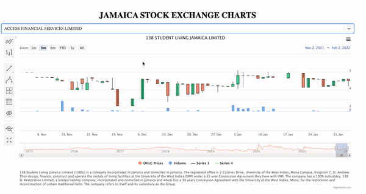

# Jamaica Stock Exchange Charts

A react app to display data from the Jamaica Stock Exchange.
You can used the deployed app here: https://jse-chart.romallen.com/

## Motivation

I created this app because I found it difficult and time consuming to navigate the JSE website and find the information that I was looking for. I also wanted to use technical analysis tools on the data and the JSE website did not offer this feature.



## Tech/framework used

<b>Built with:</b>

- [Node](https://nodejs.org)
- [React](https://reactjs.org/)
- [Highcharts](https://www.highcharts.com/)
- [AWS](https://aws.amazon.com)

## Features

This app displays price and volume data on trading done on the Jamaica Stock Exchange. This data can be viewed on line, OHLC or candlestick charts. There is also the option to display technical indicators and to make annotations to the charts using the inbuilt Stock Tools displayed on the left of the chart.

I've built a python web scraper to get the data displayed with this app. You can find that script [here](https://github.com/romallen/jse-scraper).

## Installation

1. Clone this project `git clone https://github.com/romallen/jse-chart-react.git` and cd into it `cd jse-chart-react`.
2. Install node packages `npm install`

## How to use?

### Data Sources

To populate the selection component you need to provide a link to a json object. The object contains an array called "companies". Each element of the array has the name and ticker of a company.
E.g.

```javascript
{
 "companies": [
	{
 		"name": "138 STUDENT LIVING JAMAICA LIMITED",
 		"ticker": "138SL",
 	},
 	{
 		"name": "1834 INVESTMENTS LIMITED",
 		"ticker": "1834",
 	},
 	{
 		"name": "ACCESS FINANCIAL SERVICES LIMITED",
 		"ticker": "AFS",
 	},
   ]
 }
```

To get the data for the chart you need to provide a link to a json object with the following format

```javascript
[
  [
    "MASSY HOLDINGS LTD",
    "MASSY",
    "Massy Holdings Limited is a Trinidadian conglomerate engaged in trading, service industries and finance in Trinidad and Tobago, the wider Caribbean region and Colombia. The group has been in operation since 1923 and does business along 3 primary business lines; Integrated Retail, Gas Products & Motors and Machines. Financial Services and Strategic and other investments make up the final, legacy areas of business for them. They have a primary listing on the Trinidad and Tobago Stock Exchange and are also listed on the Jamaican Stock Exchange since January 2022. The address of its registered office is 63 Park Street, Port of Spain, Trinidad.",
  ],
  [1643346000000, 2463.08, 3200, 2436, 2502.28, 35938],
  [1643605200000, 2502.28, 2690, 2200, 2439.47, 24441],
  [1643691600000, 2439.47, 2400, 2100, 2256.89, 7509],
];
```

The object is an array of arrays. The first element in the parent array contains 3 items `[company name, company ticker, company description]`.

The rest of the parent array contains OHLCV data `[date, open price, high price, low price, close price, volume]`.
\*N.B. the date should be in the UNIX format.

### Local

To run the app on your local machine use `npm run start`. In a web browser go to http://localhost:3000

### Deploy

To create a deployable bundle use `npm run build`. This create creates a public folder which can be uploaded to your desired hosting environment.

## License

MIT
